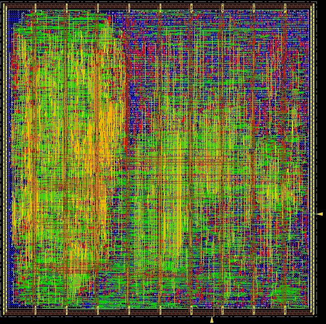

# **DLX Processor Project**

**Group project for the *Microelectronic Systems* course at Politecnico di Torino.**

---

## 🌍 Overview

This project consisted in the **design and implementation of a fully pipelined, five-stage DLX processor**, developed from the **specification** down to **synthesis and physical layout** level.

The **DLX** is a theoretical **RISC (Reduced Instruction Set Computer)** processor, whose architecture closely resembles that of **RISC-V**.
[More details about the DLX architecture ➜](https://en.wikipedia.org/wiki/DLX)

All components — except for a few partially written files provided by the professors — were designed entirely from scratch using **VHDL** as Hardware Description Language.

---

## 🔧 Tools employed

* **Visual Studio Code** to organize project files, write code and documentation, and easily integrate Git
* **Git (and GitHub)** to collaborate efficiently, enabling parallel development of independent modules and precise version tracking throughout the project.
* **(AMD) Vivado** Design Suite to develop and test VHDL code
* **(Siemens) QuestaSim** to test VHDL code
* **(Synopsys) Design Vision** for the **synthesis** and **optimization**
* **(Cadence) Innovus** to perform **physical design**
* **Diagrams.net** for all the schematics
---

## 🏆 Results achieved

After months of ideas, sketches, studying, wrong turns, right turns, endless simulations, and long working sessions, we successfully **designed, implemented, and tested** a 5-stage **pipelined** DLX processor featuring:

 * **500 MHz** operating frequency 
 * **22000 $\mu m^2$** die area
 * 1 clock cycle per **pipeline stage**
 * minimum **CPI** of 1
 * Data Hazards handling through **Forwarding** and **Stalling** mechanisms
 * A **Data cache** with direct mapping and write back policy 
 * **Branch prediction** in the ID stage via a 16-entry **Branch History Table (BHT)** with 2-bit prediction scheme
 * **Instruction Memory** and **Data Memory** interfaces (Harward Architecture)
 * The following **instruction set**:
 
   * **Addition**: `add`, `addi`, `addu`, `addui`
   * **Subtraction**: `sub`, `subi`, `subu`, `subui`
   * **Logic**: `and`, `andi`, `or`, `ori`, `xor`, `xori`
   * **Shift**: `sll`, `slli`, `srl`, `srli`, `sra`, `srai`
   * **Comparison (signed)**: `slt`, `slti`, `sle`, `slei`, `sgt`, `sgti`, `sge`, `sgei`
   * **Comparison (unsigned)**: `sltu`, `sltui`, `sleu`, `sleui`, `sgtu`, `sgtui`, `sgeu`, `sgeui`
   * **Equality**: `seq`, `seqi`, `sne`, `snei`
   * **Branch**: `beqz`, `bnez`
   * **Jump**: `j`, `jal`, `jr`, `jalr`
   * **Memory (load)**: `lb`, `lbu`, `lh`, `lhu`, `lw`, `lhi`
   * **Memory (store)**: `sb`, `sh`, `sw`
   

---

## 📂 Deliverables

Here I describe and link the main deliverables of this project that are found in this repository:
- The full **VHDL** **source code** is in the <a href="./src">`src`</a> folder.
- All the **testbenches** used for simulation are in the <a href="./testbench">`testbench`</a> folder.
- In <a href="./figures" >`figures`</a>, you can see the main **schematics** and block representations of the processor. In particular:
  -  <a href="./figures/DLX-block.pdf" >`DLX-block.pdf`</a> shows the block symbol of the DLX processor. We notice the `Clk` and `Rst` input ports, and the ports implementing the interface with Instruction and Data **Memories**.
  -  <a href="./figures/DLX-scheme-simpl.pdf" >`DLX-scheme-simpl.pdf`</a> shows a simplified schematic view of the Datapath, highlighting the Pipeline stages.
  -  <a href="./figures/DLX-scheme.pdf" >`DLX-scheme.pdf`</a> depicts the full processor **schematic** (download it for better quality), clearly showing the intricate connection between **Datapath** and **Control Unit**. Notice that, even though the **Instruction Memory** and **Data Memory** modules are represented here (as in the simplified view) for completeness, we recall that they are external with respect to the processor. Moreover, **Pipeline Registers Enable Signals** are not shown for simplicity, but they are a fundamental piece of control signals that enable pipeline stalls and flushes.
  - <a href="./figures/ALU-scheme.pdf">`ALU-scheme.pdf`</a> shows the internal logic of the ALU.
- The full project **documentation** can be read in <a href="./Report.pdf">`Report.pdf`</a>. 
- In the <a href="./synthesis">`synthesis`</a> folder you can find the **scripts** used for synthesizing the processor with _Design Vision_, along with the synthesis **reports**, **netlist** and main **schematics**.
- Finally, here's the _placed & routed_ **physical layout** of our processor:

  

---

## 🧩 Design Methodology

The design followed a **hierarchical approach**, building the processor **bottom-up**:

* Smaller, low-level components (down to the **gate level**) were developed and validated individually.
* These modules were then combined to form larger, higher-level blocks (following a *structural* design approach) — up to the **complete processor system**.
* For some modules, like memories or the forwarding/stalling unit, a *behavioral* design approach was instead used 

---

## ⛓️‍💥 Testing and Design Verification

Each module was verified through a dedicated **testbench**, forming a **chain of tested components** that enabled reliable verification of higher level components.

To validate the complete processor, we executed **assembly programs (`.asm`)** compiled with an assembler provided by the professors (therefore omitted in this repository).
A **bash script** automates the execution of the assembler on the specified `.asm` program and the loading of the generated machine code into two separate files, namely `instr_mem_init.mem` for `.text` segment and `data_mem_init.mem` for `.data` segment.  

The <a href="./testbench/TB_dlx.vhd" >`TB_dlx.vhd`</a> testbench is the one allowing the simulation of the whole system. It instantiates the **processor** and **memory** components and connects them through their interface, and it specifies the correct file paths for memory **initialization** and **logging**. The schematic of this testbench is shown in <a href="./figures/TB_dlx.pdf" >`TB_dlx.pdf`</a>. 

During simulation:
* When the `Rst` signal is asserted, **Instruction Memory** and **Data Memory** are loaded with the executable code and data from the respective `.mem` initialization files.
* After `Rst` is disabled, the sequence of instructions loaded into the Instruction Memory starts to be executed. 
* Everytime they are updated, the **Register File**, **Data Cache** and **Data Memory** automatically log their contents to their respective output files, namely `reg_file.mem`, `data_cache.mem` and `data_mem.mem`.
 
At the end of the simulation, we can inspect the produced files to verify correctness and ensure that program execution matched expected behavior. If any incorrectness is detected, white box testing can be performed by looking at the internal **waveforms** of the system.

**NOTICE**: the files in this repository alone are not enough to perform the simulation descrbied above, as we would need the **assembler** program, omitted for copyright reasons. 

---

## 📈 Skills and Experience Gained

This project provided extensive hands-on experience in digital design, processor microarchitecture, and EDA tools. In particular, it provided me with **experience** and technical **skills** in the following areas:

- Digital Hardware Design
- VHDL language
- RISC Architectures
- Branch Prediction mechanisms
- Data Dependencies
- Cache and Memory System design
- Hardware Verification and Testbench development
- EDA Toolchain
- Hierarchical Design methodology
- Git-based collaborative development
- Performance Analysis and Optimization

Moreover, this project allowed me to improve on other important skills such as:
- Teamwork
- Problem Solving
- Leadership and team management
- Efficient organization

---

## 🏹 Possible improvements

* Implement multicycle operations: **multiplication** and **division**
* Implement a **windowed register file** for **multi-threading**
* Implement **exception handling**
* Optimize the design for **power** and **performance**

---

##  🫱🏻‍🫲🏻 Acknowledgments 

I'd like to thank my colleagues **Stefano Galati** and **Emanuele Aquilia** for an amazing work performed during this project. I'd also like to thank the professor and teaching assistants of the **Microelectronic Systems** course for the material and knowledge provided. Finally and most importantly, a big acknowledgment goes to **John L. Hennessy** and **David A. Patterson**, the creators of the DLX Architecture and authors of the book **Computer Architecture: A Quantitative Approach**, which has been of incredible use and provided us with the main Processor Architecture concepts that most of the project is based upon. 
